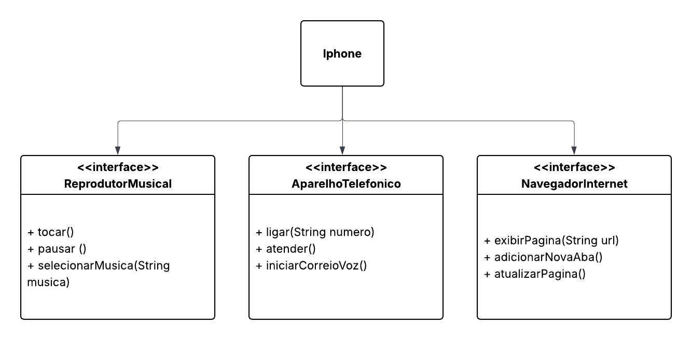

# 📱 Desafio POO - Componente iPhone (Java + UML)

Este repositório contém a modelagem UML e a implementação em Java do componente **iPhone**, proposto como desafio prático na plataforma DIO.

O objetivo foi simular o comportamento de um iPhone clássico, com funcionalidades divididas em três áreas principais:

* 🎵 Reprodutor Musical
* 📞 Aparelho Telefônico
* 🌐 Navegador na Internet

---

## 📌 Estrutura do Projeto

O projeto é baseado em **Programação Orientada a Objetos (POO)** e utiliza **interfaces** para representar funcionalidades distintas, que são então implementadas por uma única classe concreta (`IPhone`).

```
📁 src/
├── AparelhoTelefonico.java
├── NavegadorInternet.java
├── ReprodutorMusical.java
└── IPhone.java
```

---

## 🧹 Interfaces

### 🎵 ReprodutorMusical

```java
void tocar();
void pausar();
void selecionarMusica(String musica);
```

### 📞 AparelhoTelefonico

```java
void ligar(String numero);
void atender();
void iniciarCorreioVoz();
```

### 🌐 NavegadorInternet

```java
void exibirPagina(String url);
void adicionarNovaAba();
void atualizarPagina();
```

---

## 💻 Implementação da Classe `IPhone`

A classe `IPhone` implementa todas as interfaces e simula o comportamento de cada funcionalidade, exibindo mensagens no terminal para cada método chamado.

---

## 📝 Exemplo de Uso

```java
public class Main {
    public static void main(String[] args) {
        IPhone iphone = new IPhone();

        iphone.tocar();
        iphone.selecionarMusica("Imagine - John Lennon");

        iphone.ligar("99999-9999");
        iphone.atender();

        iphone.exibirPagina("https://www.apple.com");
        iphone.atualizarPagina();
    }
}
```

---

## 🧬 Conceitos Aplicados

* Programação Orientada a Objetos
* Abstração com Interfaces
* Encapsulamento
* Responsabilidade Única
* Implementação em Java

---

## 📷 Diagrama UML

> Veja abaixo a representação UML do projeto:



---


